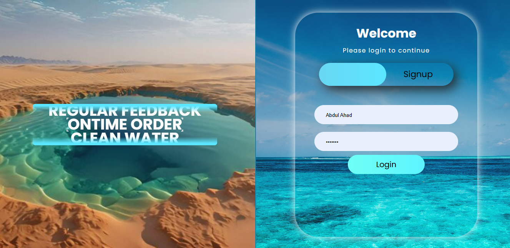
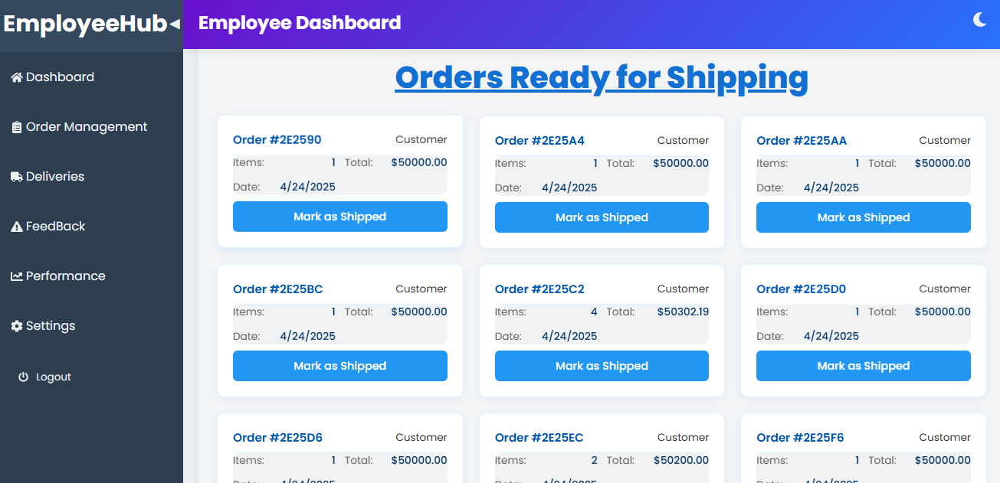

<!-- PROJECT BANNER -->
# Quench&nbsp;Thirst  
*A real-time water-tank monitoring & dispatch platform*

[](LICENSE) 
[](../../issues) 
[](CONTRIBUTING.md)

> Digital logistics and automatic control for municipal water tanks.

---

## Table&nbsp;of&nbsp;Contents
1. [About](#about)  
2. [Features](#features)  
3. [Screenshots](#screenshots)  
4. [Quick&nbsp;Start](#quick-start)   
5. [Directory Overview](#overview)  
6. [Contributing](#contributing)  
7. [License](#license)  
8. [Contact & Acknowledgements](#contact--acknowledgements)

---

## About
Water shortages are worsening in many Pakistani cities. Households often rely on private tankers booked by phone and logged in paper registers. The process is slow, opaque and error-prone.

**Quench Thirst** replaces manual ledgers with a real-time web system that:

* measures tank levels with IoT sensors  
* auto-dispatches tanker routes through an Express API  
* gives residents and municipal teams a live dashboard  

The stack is familiar—**Node.js &nbsp;|&nbsp; Express &nbsp;|&nbsp; MongoDB &nbsp;|&nbsp; React**—so local devs can extend it without steep learning curves.

---

## Features
- Live tank-level charts with 5-second polling  
- Automatic SMS / WhatsApp alerts when levels fall below a threshold  
- One-click tanker dispatch; optimal routes via Google Maps API  
- Role-based access (Resident, Driver, Admin)  
- Audit log of deliveries and complaints  
- PWA install for offline-first field use  
- UI inspired by Google Keep—clean panels, soft shadows

---
## Repository Overview

- See the detailed repository on **GitIngest**:  
[GitIngest - Quench Thirst](https://gitingest.com/AbdulAHAD968/QUENCH-THIRST/)

---

## Screenshots
| View | Preview |
|------|---------|
| Login Page |  |
| Admin Dashboard |  |
| User Dashboard |  |
| Employee Dashboard |  |
| Sales Tracking |  |
| Order Management |  |

*(PNG assets live under `./assets/`)*

---

## Quick Start
### Prerequisites
| Tool | Version |
|------|---------|
| Node.js | ≥ 18 LTS |
| MongoDB | ≥ 6.0 |
| Yarn | ≥ 1.22 |

---

### Installation
```bash
git clone https://github.com/your-org/quench-thirst.git
cd quench-thirst
cp .env.example .env        # add your keys
yarn && yarn bootstrap      # install root + workspace deps
```

---

### Contributing

```bash
Fork ➜ Create branch ➜ Commit ➜ Pull request
```
- Follow the ESLint/Prettier rules (yarn lint --fix).
- Small, focused PRs are easier to review. Questions? Open a draft PR early.

---

### License
Distributed under the MIT License. See LICENSE for details.

---

### Contact & Acknowledgements

Maintainers:
- Abdul Ahad · @AbdulAHAD968
- Team Quench Thirst, Islamabad

